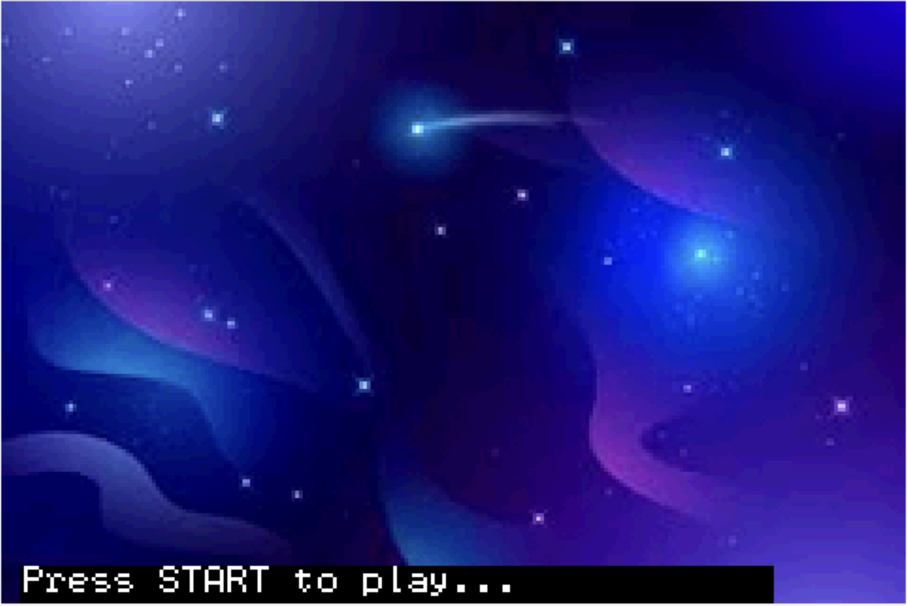
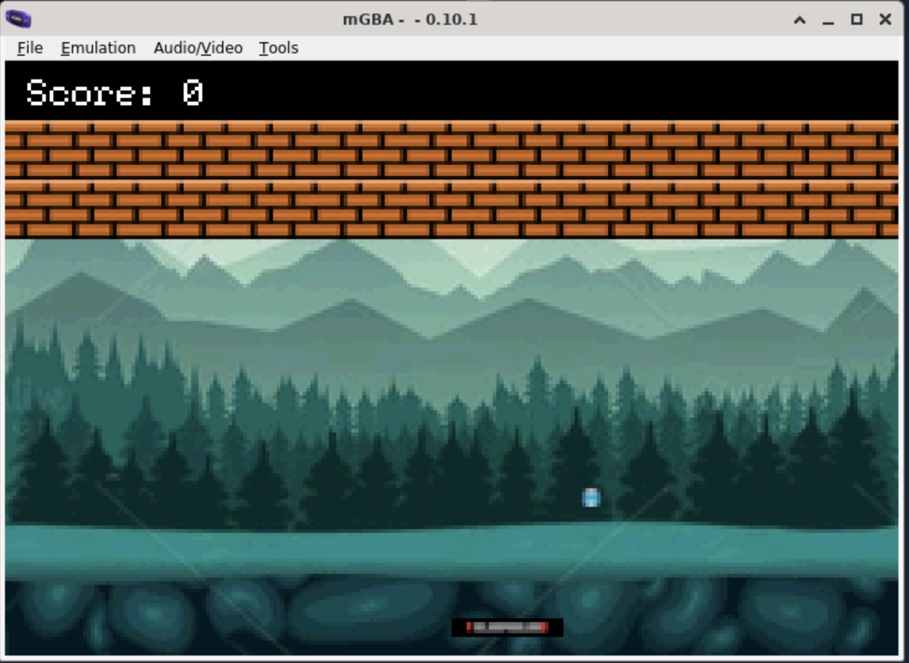

# Brick-Breaker-C

Developed a brick breaker game in C that runs on a Game Boy Advance (GBA) emulator. 
(Docker image created to run GBA program. cmd: "$make mgba"

| Start Page | Game View |
|:----:|:----:|
| | |